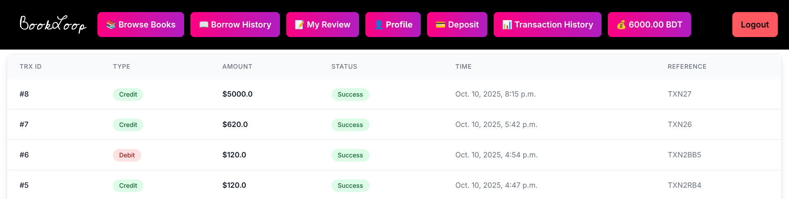

# This project is not currently ready for running.

<!-- > URL- https://bookloop-s6np.onrender.com -->

### Table Of Contents
- [Introduction](#️-1-introduction)
- [Project description](#-2-project-description)
- [Motivation](#-3-motivation)
- [Installation and setup](#installation-and-setup)
- [Sample Screenshot](#screenshot)
# 🏛️ 1. Introduction

The Library Management System is a Django-based web application developed to digitalize and simplify the conventional library experience. It provides a structured and secure platform where both administrators and readers can interact through an online environment. The system ensures automation in book management, secure online transactions, and an interactive reading community. By integrating modern technologies such as the SSL payment gateway and user authentication, the project aims to eliminate manual handling and promote a seamless, cashless library experience for all users.


# 📚 2. Project Description

This system allows the admin to efficiently manage the library database by adding, updating, and categorizing books. The users can register and log in to the platform to access the full range of services. Through a secure SSL payment gateway, users can deposit money into their accounts, which serves as a wallet for borrowing books.

When a user borrows a book, a specific amount is automatically deducted as a security deposit. If the book is returned within the due date, the deposited money is refunded. In case of a late return, a fine or penalty is applied. All transactions are recorded in the user’s transaction history, ensuring full transparency.

Users can post book reviews based on their borrowing records — each borrow record allows one review per book. Additionally, the platform supports a discussion section where multiple readers can communicate and exchange opinions about a specific book, fostering collaboration and learning.

Only authenticated users can perform operations like borrowing, reviewing, and discussing. However, visitors can still explore available books and view existing reviews before registering.


# 🌟 3. Motivation

The motivation behind developing this project is to build an open-source, cashless, and community-driven library system that encourages reading and knowledge sharing in a modern, digital environment. Traditional libraries often face challenges such as manual record-keeping, delayed transactions, and limited accessibility.

By integrating online payments, automated fine calculation, and interactive discussions, this system reduces human error and enhances user engagement. The project envisions creating a secure and hassle-free readers’ community where literature enthusiasts can borrow, review, and discuss books effortlessly. Ultimately, it promotes the vision of a digitally connected reading culture that bridges the gap between technology and education.


### 🧾 **1. Book Model**

Represents a book in the library.

**Fields:**

* `title`: Book name.
* `description`: Book summary/details.
* `author`: Author name.
* `add_date`: Date the book was added.
* `borrow_price`: Borrowing cost per use.
* `book_image`: Book cover image.
* `added_by`: The admin/user who added the book.
* `category`: Linked categories (Many-to-Many).
* `quantity`: Total available copies.
* `total_borrowed_time`: Number of times borrowed.

---

### 📚 **2. Borrow_record Model**

Tracks each borrowing activity.

**Fields:**

* `user`: Who borrowed the book.
* `book`: Which book was borrowed.
* `borrow_date`: When it was borrowed.
* `return_status`: Current status (e.g., pending/returned).
* `due_date`: Deadline for returning.
* `return_date`: When actually returned.
* `created_at`: Record creation time.
* `review_status`: Whether a review was given or not.

---

### 🏷️ **3. Category Model**

Defines book categories or genres.

**Fields:**

* `title`: Category name.
* `added_by`: Who created the category.
* `add_date`: When it was added.
* `slug`: Unique URL-friendly identifier.

---

### 💬 **4. Discussion Model**

Handles user discussions/comments about books.

**Fields:**

* `user`: Who commented.
* `book`: Which book discussion is about.
* `comment`: Text content of the discussion.
* `discussion_image`: Optional discussion image.
* `created_at`: When discussion was created.

---

### ⭐ **5. Review Model**

Stores user reviews for borrowed books.

**Fields:**

* `user`: Reviewer.
* `book`: Reviewed book.
* `borrow_record`: Links to that specific borrow instance.
* `rating`: Given rating (choice field).
* `comment`: Optional text review.
* `review_image`: Optional image in review.
* `created_at`: When review was made.

---

### 💳 **6. Transaction Model**

Logs user payments and deposits.

**Fields:**

* `user`: Who made the transaction.
* `amount`: Transaction amount.
* `transaction_type`: Type (Deposit, Deduct, Refund, etc.).
* `payment_status`: Status (Success, Pending, Failed).
* `created_at`: Time of transaction.
* `reference`: Transaction reference ID/details.

---

### 👤 **7. User Model (Custom User Info)**

Extends Django’s default user with library-specific data.

**Fields:**

* `user`: Links to Django’s base `User`.
* `email`: User’s email (unique).
* `contact_no`: Phone number (unique).
* `borrowed_books`: Books currently borrowed (Many-to-Many).
* `gender`: Gender info.
* `deposit_date`: When deposit was made.
* `balance`: Current wallet/balance amount.
* `dob`: Date of birth.
* `joining_time`: Account creation/joining time.
* `user_image`: Profile picture.
* `user_type`: Role (Admin/User).

---

> Prerequirement: Python


## Installation and Setup

- Open terminal and install git (if not installed ).

- project clone 

```bash
git clone https://github.com/Arannamoy-Mondal/BookLoop.git
```

- Create virtual environment

```bash
python -m venv .venv
```

- Activate virtual environment

`For Windows`

```bash
.venv/Scripts/activate
```

`For Linux`

```bash
source .venv/bin/activate
```

- Install requirements.txt

```bash
pip install -r requirements.txt
```

- Run project

```bash
cd BookLoop
python manage.py runserver 
```

#### Requirements.txt without version

```bash
pip freeze | python -c "for p in __import__('sys').stdin: print(p.split('=')[0])" > requirements.txt
```

#### Generated Project File Structure (Using Tree Command)

```bash
tree -a -I 'node_modules|.git|__pycache__|.vscode|migrations|.venv | ss | .env' > structure.txt
```
### root@1234


### Screenshot





# 